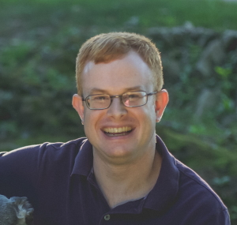
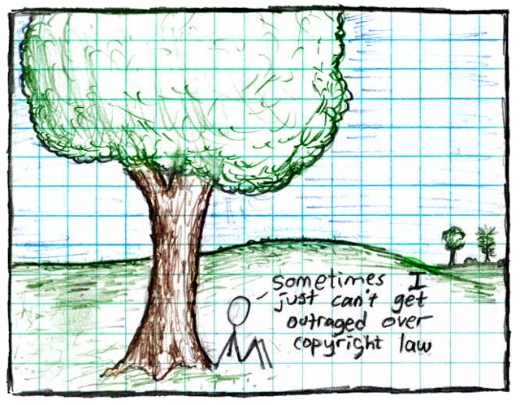

# Wstęp do kursu

## Informacje o kursie

### Wstęp do kursu

**Witaj na kursie Podstaw licencjonowania otwartego oprogramowania dla programistów (LFC191-pl)!**

Zrozumienie, jak działają prawa autorskie i licencje, oraz umiejętność ich jasnego i dokładnego określania są kluczowe, jeśli chcesz, aby twój wkład w projekty otwartego oprogramowania (open source) został zaakceptowany i nadawał się do wykorzystania oraz aby zapisy licencji były zgodne z twoimi intencjami.

Licencje z góry udzielają zgody na wykorzystanie twojego kodu każdemu, kto chce z niego skorzystać. Konkretne zgodny są określane poprzez wybór licencji przez właściciela praw.

Ten kurs stworzyliśmy po to, aby pomóc programistom i innym osobom biorącym udział w tworzeniu oprogramowania przeznaczonego do szerszego użytku i dystrybucji. Dzięki niemu zrozumiesz, jak ważne jest dodanie informacji o licencjach i prawach do kodu oraz jak to zrobić.

Kurs zawiera również informacje na temat tworzenia oznaczeń o uznaniu autorstwa i zapisach licencji. Wiedza, jak unikać problemów i niejednoznaczności, przydaje się zarówno w wewnętrznych projektach firmowych, jak i w projektach otwartego oprogramowania.

Przedstawiliśmy również przegląd wartych rozważenia typów licencji oraz mechanizmów współtworzenia kodu.

### Założenia kursu

Biorąc udział w kursie, będziesz mieć szansę:

* zrozumieć, dlaczego dodawanie informacji o uznaniu autorstwa i licencjach do kodu jest ważne,
* dowiedzieć się, jak zrobić to sprawnie i skutecznie,
* zrozumieć mechanizmy używane przy współtworzeniu kodu w projekcie.

### Poznaj instruktorów

#### Kate Stewart

Kate Stewart jest Starszym Dyrektorem Programów Strategicznych i dopowiada za program Open Compliance, w skład którego wchodzą SPDX, FOSSology, OpenChain oraz inne projekty związane ze zgodnością. Kate była jedną z osób tworzących SPDX w 2010 r., a obecnie odpowiada za specyfikację. W ramach współpracy z Linux Foundation uruchomiła projekty Real-Time Linux, Zephyr, CHAOSS, ELISA oraz ACT.

Przez ponad 30 lat pracy w sektorze oprogramowania pełniła wiele funkcji i pracowała jako programistka w Kanadzie, Australii i USA, a przez ostatnie 20 lat zarządzała zespołami programistów w USA, Kanadzie, Zjednoczonym Królestwie, Indiach i Chinach. Ukończyła studia drugiego stopnia w zakresie informatyki na University of Waterloo oraz pierwszego (w programie stażowym typu co-op) na University of Manitoba.

#### Steve Winslow

Steve Winslow jest Dyrektorem Programów Strategicznych w Linux Foundation. Prowadzi program skanowania i wsparcia analiz licencji w Linux Foundation, doradzając projektom otwartego oprogramowania w sprawach licencji określonych w ich kodzie źródłowym i zależnościach. Steve współprowadzi zespół prawny SPDX, a także bierze udział w projektach takich jak FOSSology i Community Data License Agreement, kieruje programem znaków zastrzeżonych Linux Foundation oraz pomaga w innych projektach w zakresie zagadnień prawnych, wytycznych i zarządzania.

### Uczestnicy i wymagania kursu

Ten kurs stworzyliśmy po to, aby pomóc programistom i innym osobom biorącym udział w tworzeniu oprogramowania przeznaczonego do dalszej dystrybucji oraz każdemu, kto chciałby współtworzyć projekty otwartego oprogramowania.

Doświadczenie nie jest wymagane.

### Po co zawracać sobie głowę licencjami i prawem autorskim przy kodowaniu?

Pobrano z [xkcd.com](https://xkcd.com/14/), na licencji [CC-BY-NC-2.5](https://creativecommons.org/licenses/by-nc/2.5/).

**Licencja** informuje o tym, jak można wykorzystywać kod i jak łączyć go z innym oprogramowaniem.

Powyższy obrazek pochodzi z początków xkcd. Ponieważ twórca określił jego licencję, po zapoznaniu się z nią wiemy, że możemy dodać go do tego kursu, nie naruszając przy tym praw twórcy.

Skoro ten kurs jest dostępny za darmo w celach edukacyjnych i ponieważ zaznaczyliśmy, kto jest autorem obrazka, postępujemy zgodnie z licencją CC-BY-NC 2.5. Celem tego kursu nie jest osiągnięcie korzyści majątkowych ani wykorzystanie komercyjne - służy on edukacji, więc możemy zamieścić ten obrazek, żeby pokazać, o co nam chodzi.

Celem określenia licencji jest udzielenie z góry zgody osobom chcącym wykorzystać twoją pracę.

Dużą część infrastruktury technicznej, z której korzystamy na co dzień bez zastanowienia, zawdzięczamy wcześniejszym decyzjom licencyjnym konkretnych właścicieli praw autorskich. Więc jeśli chcesz skorzystać z czyjejś pracy, to prosimy: uszanuj licencję, którą wybrali.

Wielu twórców oprogramowania i sprzętu komputerowego napotka materiały open source w pracy i prywatnych projektach.

Do materiałów open source mogą należeć oprogramowanie, projekty urządzeń, narzędzia, dokumenty, nagrania audio i pliki graficzne.

Mimo że materiały open source są zazwyczaj wolnodostępne, zazwyczaj udostępniane są na określonej licencji. Dzięki wybranej licencji materiały można uznać za pochodzące z „otwartego źródła” (open source), a o wyborze licencji dla nich decyduje właśnie **właściciel praw autorskich**.

Prawa autorskie (copyright) są oparte na przepisach poszczególnych krajów i nadają właścicielowi praw pewne wyłączne uprawnienia do kontroli wykorzystania i dystrybucji jego utworu.

Właściciele praw autorskich mają wyłączne prawo do własnej twórczości. Prawa autorskie są wykorzystywane do ochrony konkretnych form twórczości, czasem określanych też jako utwór autorski.

Zazwyczaj myślimy o prawach autorskich jako ochronie rzeczy takich jak książki, filmy, muzyka, mapy i dzieła sztuki. Prawa autorskie mogą chronić też projekty sprzętu i oprogramowanie oraz inne dzieła twórcze.

Prawa stosujące się do kodu źródłowego mogą różnić się w zależności od kraju, ale ogólnie uznaje się, że dotyczą kopiowania, modyfikowania lub tworzenia prac pochodnych. Inne prawa regulują działania takie jak wystawienie sztuki teatralnej lub publiczna prezentacja obrazu. Powiemy o tym więcej już niedługo.

## Zanim zaczniesz

### Terminarz kursu

Tempo tego kursy zależy wyłącznie od ciebie, nie ma z góry określonych terminów na przerobienie materiału. Możesz brać udział w kursie w swoim własnym tempie. Na początku każdej nowej sesji przekierujemy cię dokładnie tam, gdzie skończyła się poprzednia sesja. Mimo to sugerujemy, aby nie robić sobie dłuższych przerw w nauce. Ukończysz kurs szybciej, a ilość zapamiętanego materiału będzie większa.

Kolejne rozdziały kursu bazują na poprzednich. Dlatego wydaje się, że najlepiej będzie przerabiać je po kolei. Jeśli jakiś przeskoczysz lub tylko przejrzysz pobieżnie, może się okazać, że nie znasz jeszcze tematów omawianych w kolejnym rozdziale. Ale tempo jest dostosowane do ciebie. Zawsze możesz wrócić i przejść przez materiał własną ścieżką.

### Oceny

Na końcu każdego rozdziału znajduje się seria **nieocenianych pytań sprawdzających**. Pytania te stworzyliśmy w jednym celu - aby pomóc ci lepiej zrozumieć materiał kursu i zapamiętać to, czego się uczysz. 

Aby ukończyć ten kurs, **musisz przystąpić do egzaminu końcowego**. Musisz zdobyć wynik **90% lub więcej**, aby zdać egzamin i ukończyć kurs. Jeśli nie zdasz egzaminu, będziesz mieć szansę podejść do niego ponownie tyle razy, ile będzie trzeba, aby otrzymać pozytywny wynik.

### Noty prawne, o prawach autorskich i licencjach

Copyright 2016-2021, The Linux Foundation.

Ten kurs jest objęty licencją [Creative Commons Uznanie autorstwa-Na tych samych warunkach 4.0 Międzynarodowe (CC-BY-SA-4.0)](https://creativecommons.org/licenses/by-sa/4.0/), za wyjątkiem treści z innych źródeł oznaczonych osobnymi licencjami.

---

**Poniżej określiliśmy pewne zalecane najlepsze praktyki, ale zawsze konsultuj się z własnym radcą prawnym.**

Ten kurs NIE stanowi porady prawnej. Porady prawne zawsze odnoszą się do konkretnych sytuacji i zależą od prawa obowiązującego na danym terytorium.

Zawsze konsultuj się ze swoim radcą prawnym i postępuj zgodnie z zaleceniami, jeśli różnią się od rekomendacji zawartych w tym kursie.

Ten kurs został stworzony przez pracowników Linux Foundation, więc to Linux Foundation jest właścicielem praw autorskich i określa jego licencję.

Ten kurs jest objęty licencją CC-BY-SA-4.0. Jest to jedna z kilku licencji opracowanych przez organizację Creative Commons. Ta konkretna licencja pozawala wszystkim na remiksowanie, przetwarzanie lub tworzenie na podstawie tego utworu, nawet w celach komercyjnych, o ile prawidłowo oznaczą ten utwór, a swoje nowe utwory obejmą identycznymi warunkami licencji.

CC-BY-SA-4.0 jest podobna do licencji używanej przez Wikipedię i zaleca się ją w przypadku materiałów, które mogą skorzystać na dołączeniu treści z Wikipedii i projektów objętych podobnymi licencjami. Opowiemy o tym więcej w dalszej części kursu.

## Linux Foundation

### Linux Foundation

[Linux Foundation](https://www.linuxfoundation.org/) zapewnia neutralny i zaufany ośrodek programowania, zarządzania i skalowania projektów opartych na otwartych technologiach. Od czasu założenia w 2000 r. Linux Foundation wspiera ponad 1000 członków. Jest ona wiodącym w skali świata ośrodkiem współpracy w zakresie projektów otwartego oprogramowania, otwartych standardów, otwartych danych i otwartego sprzętu. Metodologia Linux Foundation skupia się na wykorzystaniu najlepszych praktyk i wychodzi naprzeciw potrzebom współtwórców, użytkowników i dostawców usług, aby tworzyć trwałe modele otwartej współpracy.

W Linux Foundation tworzony jest Linux - największy na świecie i najbardziej rozpowszechniony projekt otwartego oprogramowania w historii. Tu również zadomowili się Linus Torvalds i główny opiekun Greg Kroah-Hartman. Sukces Linuxa był katalizatorem wzrostu społeczności otwartego oprogramowania. Wykazał komercyjną opłacalność otwartego oprogramowania i zainspirował niezliczone nowe projekty z każdej możliwej branży i poziomu technologicznego.

Dzięki temu pod dachem Linux Foundation rozwija się o wiele więcej niż sam Linux - wiele kluczowych projektów otwartego oprogramowania, które dziś napędzają działania korporacji z każdego w zasadzie sektora przemysłu. Do technologii, na których się skupiamy, należą między innymi big data i big analytics, technologie sieciowe, systemy wbudowane, rozwiązania chmurowe, przetwarzanie brzegowe, motoryzacja, bezpieczeństwo, blockchain i wiele, wiele innych.

### Wydarzenia Linux Foundation

Ponad 85 000 inżynierów i liderów z całego świata zbiera się co roku na wydarzeniach organizowanych przez Linux Foundation, aby dzielić się pomysłami, uczyć i współpracować. Wydarzenia Linux Foundation są ulubionym miejscem spotkań opiekunów, programistów i architektów otwartego oprogramowania, menadżerów infrastruktury, sysadminów i inżynierów prowadzących biura programów otwartego oprogramowania oraz innych osób pełniących kluczowe funkcje kierownicze.

Nasze wydarzenia to najlepsza okazja, aby szybko zaprezentować się społeczności otwartego oprogramowania i rozwijać prace w projektach open source, łącząc się z ludźmi oceniającymi i tworzącymi nowe generacje technologii. Są one forum wymiany i zdobywania wiedzy. Pomagają organizacjom na wczesnym etapie identyfikować nowe trendy i decydować o kierunkach przyszłych inwestycji. Łączą pracodawców z utalentowanymi pracownikami i prezentują technologie i usługi wpływowym specjalistom od otwartego oprogramowania, mediom i analitykom z całego świata.

Co roku Linux Foundation organizuje coraz więcej wydarzeń, takich jak:

* Open Source Summit North America, Europe, and Japan
* Embedded Linux Conference North America and Europe
* Open Networking & Edge Summit
* KubeCon + CloudNativeCon North America, Europe, and China
* Automotive Linux Summit
* KVM Forum
* Linux Storage Filesystem and Memory Management Summit
* Linux Security Summit North America and Europe
* Linux Kernel Maintainer Summit
* The Linux Foundation Member Summit
* Open Compliance Summit
* i wiele innych.

Możesz dowiedzieć się więcej o [wydarzeniach Linux Foundation](https://events.linuxfoundation.org/) online.

### Miejsca szkoleń

Szkolenia Linux Foundation są tworzone dla społeczności i przez społeczność, a ich treści i instruktorzy pochodzą z najwyższej półki społeczności twórców Linuxa.

Linux Foundation oferuje kilka typów szkoleń:

* stacjonarne,
* online,
* u klienta,
* w połączeniu z wydarzeniami.

Uczestnicy otrzymują szkolenia związane z Linuxem i otwartym oprogramowaniem niezależne od dystrybucji, zaawansowane technicznie i tworzone bezpośrednio przez faktycznych liderów społeczności twórców Linuxa i otwartego oprogramowania. Linux Foundation oferuje uczestnikom szkoleń szeroki zakres fundamentalnej wiedzy i kontaktów sprzyjających w rozwoju kariery w dzisiejszych czasach. Zarówno szkolenia Linux Foundation online, jak i prowadzone bezpośrednio pomogą tobie i twojemu zespołowi programistów wyprzedzać trendy w rozwoju otwartego oprogramowania.

### Oferta szkoleń Linux Foundation

Nasza aktualna oferta kursów obejmuje:

* szkolenia programowania i rozwoju Linuxa,
* kursy administracji systemami Linuxa i zasobami IT przedsiębiorstw,
* kursy związane ze zgodnością w otwartym oprogramowaniu.

Aby otrzymać więcej informacji na temat konkretnych kursów oferowanych przez Linux Foundation, w tym wymagania techniczne i szczegóły organizacyjne, odwiedź stronę [Linux Foundation training](https://training.linuxfoundation.org/) website.

### Certyfikaty Linux Foundation

[Certyfikaty Linux Foundation](https://training.linuxfoundation.org/certification/) to sposób na wyróżnienie się na rynku pracy łaknącym umiejętności takich jak twoje. Wybraliśmy nowe i innowacyjne podejście do certyfikacji w zakresie otwartego oprogramowania, dzięki któremu zaprezentujesz swoje umiejętności w sposób budzący szacunek współpracowników i zaufanie pracodawców:

Egzaminy certyfikujące możesz zdawać z każdego komputera, w dowolnym czasie i miejscu:

* egzaminy certyfikujące sprawdzają skuteczność działania​,
* egzaminy są niezależne od dystrybucji,
* egzaminy są aktualne - sprawdzają wiedzę i umiejętności, które rzeczywiście liczą się w dzisiejszym świecie IT.

### Firewall szkoleń/ certyfikacji

Linux Foundation ma dwa niezależne działy szkoleniowe: Organizacji kursów i Certyfikacji. Oba działy rozdziela **firewall**. 

Dział Linux Foundation odpowiedzialny za tworzenie programów kursów nie ma bezpośredniego wpływu na opracowanie, zarządzanie ani ocenianie egzaminów certyfikacyjnych. 

Wprowadzenie własnego firewalla tego rodzaju zapewnia niezależnym organizacjom i firmom możliwość tworzenia własnych materiałów szkoleniowych, aby pomóc uczestnikom testów zdać egzaminy certyfikacyjne. 

Co więcej, to rozwiązanie zapewnia, że nie ma żadnych „tajnych trików” (ani innych sekretów), które trzeba znać, aby z powodzeniem zdać egzamin. 

Pozwala ono również Linux Foundation tworzyć bardzo rozbudowane zestawy kursów, które oferują o wiele więcej niż przygotowanie do testu. Dają uczestnikom szeroką wiedzę z wielu dziedzin, w których muszą stać się ekspertami, aby odnieść sukces zawodowy w administrowaniu systemami opartymi na otwartym oprogramowaniu.
