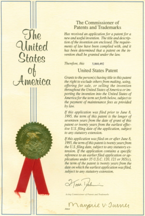

# Licencje

## Wprowadzenie

### Przegląd rozdziału

W tym rozdziale zaprezentujemy przegląd typowych licencji oprogramowania i powiemy, dlaczego to ważne, aby zaznajomić się z nimi i właściwie je określać.

### Założenia rozdziału

W tym rozdziale nauczysz się, jak:

* rozróżniać główne typy licencji używanych dla oprogramowania,
* korzystać ze źródeł dodatkowych informacji o licencjach, których możesz użyć, i cechach tych licencji,
* wskazywać konkretne licencje oprogramowania w swoim kodzie.

## Licencje

### Czym są licencje?

Zgodnie z [Wikipedią](https://en.wikipedia.org/wiki/Software_license):

> Licencja oprogramowania jest instrumentem prawnym (...) określającym zasady wykorzystania lub rozprowadzania oprogramowania.

Przyjrzymy się nieco bliżej tej definicji.

#### "Oprogramowanie"

*Oprogramowanie* odnosi się do napisanego przez autora dokumentu reprezentującego program lub oprogramowanie sprzętowe. Autorem oprogramowania może być jedna lub wiele osób, być może wykonujących pracę na zlecenie firmy. 

Program ma na celu stworzenie wykonywalnej przez maszynę wersji algorytmu lub idei. Do napisania oprogramowania można używać wielu różnych języków komputerowych, które są kompilowane lub interpretowane do języka maszynowego.

#### "Instrument prawny"

[Instrument prawny](https://en.wikipedia.org/wiki/Legal_instrument) to termin **prawniczy** używany w odniesieniu do dowolnego dokumentu wyrażonego na piśmie (np. programu komputerowego), który można formalnie przypisać do jego autora, który zapisuje i formalnie wyraża wiążące prawnie działanie, proces, obowiązki umowne lub inne zobowiązania lub prawa, a tym samym dokumentuje działanie, proces lub umowę.

#### "Określenie zasad wykorzystania"

*Określenie zasad wykorzystania* opisuje, w jaki sposób osoby lub firmy mogą korzystać z oprogramowania. Co jest dozwolone a co nie? Czy wolno udostępniać je publicznie, wykorzystywać wewnątrz firmy lub na użytek osobisty w domu?

#### "Redystrybucja"

*Redystrybucja* określa, jak można rozprowadzać oprogramowanie. Czy osoba korzystająca z niego może dać kopię przyjacielowi, dokonywać zmian, tworzyć dzieła pochodne, zamieszczać online itd.?

---

Czyli licencja to przyznanie praw przez twórców oprogramowania użytkownikom, określające, jak można z niego korzystać i je udostępniać. Jest to zestaw wskazówek dotyczących obowiązków i zobowiązań związanych z używaniem i udostępnianiem programu komputerowego.


Diagram pokazuje, że licencje oprogramowania dzielą się na dwa główne typy. „Zastrzeżone” oraz „wolne” - czyli otwarte oprogramowanie. Warunki, na jakich użytkownik może wykorzystywać lub udostępniać kopię oprogramowania, określają ogólnie, do której kategorii ono należy. 

Niektóre programy mogą być udostępnione do pobrania za darmo, ale - o ile nie określono dla nich licencji otwartego oprogramowania - nie są one otwartym oprogramowaniem. W szczególności jeśli program można pobrać za darmo, ale nie określono dla niego żadnej licencji, nie można uznać, że jest to „otwarte oprogramowanie”.

Żeby nie komplikować, w dalszej części kursu będziemy po prostu odnosić się do licencji wolnego oprogramowania i otwartego oprogramowania jako „otwarte oprogramowanie” (lub open source), a do licencji, które nie są otwarte, jako „zastrzeżone”.

### Rodzaje licencji

Większość licencji można przypisać do jednej z dwóch ogólnych kategorii: zastrzeżone lub otwarte.

#### Licencje zastrzeżone

Licencje zastrzeżone to takie, w których właściciel praw autorskich zastrzega pewne lub wszystkie prawa dla siebie i często nakłada na użytkowników dodatkowe ograniczenia w zakresie tego, co mogą zrobić z oprogramowaniem. Licencje zastrzeżone różnią się w zależności od firmy i projektu.

Część oprogramowania zastrzeżonego jest komercyjna i musisz wykupić licencję, jeśli chcesz z niego korzystać, ale inne programy zastrzeżone mogą być wolnodostępne.

Przede wszystkim przeczytaj warunki licencji zastrzeżonej i upewnij się, że będziesz w stanie ich przestrzegać przed włączeniem oprogramowania objętego taką licencją we własny program. Na przykład niektóre zastrzeżone licencje wymagają wyraźnego potwierdzenia przeczytania licencji. **Jeśli nie możesz zrozumieć warunków lub stosować się do nich, nie korzystaj z kodu!**

#### Otwarte licencje

Za otwarte licencje zazwyczaj uznaje się te zgodne z definicją otwartego oprogramowania opracowaną przez [Open Source Initiative](https://opensource.org/) organization. Pozwalają one na dowolne użycie, modyfikację i udostępnianie oprogramowania.

Otwarte licencje ogólnie dzieli się na:

* **Permisywne lub Copyleft** - takie licencje mogą nie nakładać żadnych lub niewiele ograniczeń na licencjobiorcę, zezwalając na wykorzystanie i rozprowadzanie w aplikacjach zastrzeżonych. Mogą również wymagać przekazania kolejnym odbiorcom tych samych uprawnień, którymi objęte było rozprowadzane oprogramowanie - również w przypadku dzieł pochodnych lub dodanych do niego.
* **Patent Grant (Udzielenie patentu) lub No Patent Grant (Nieudzielenie patentu)** - udzielenie patentu może być wyraźnie określone lub implikowane w tekście (dorozumiane). W przypadku niektórych licencji może nie zachodzić udzielenie patentu, przez co nie można uznać licencji za otwartą. 

Już niedługo omówimy te kategorie bardziej szczegółowo.

---

Aby dowiedzieć się więcej o licencjach otwartego oprogramowania, przejrzyj stronę Open Source Initiative - ["Licenses & Standards"](https://opensource.org/licenses).

### Definicja otwartego oprogramowania

Aby kod można było uznać za otwarte oprogramowanie, licencja, jaką jest objęty, powinna charakteryzować się właściwościami określonymi w [Open Source Definition](https://opensource.org/osd-annotated) dokumencie utrzymywanym przez [Open Source Initiative](https://opensource.org/) (OSI).


Logo OSI jest znakiem towarowym Open Source Initiative. Źródło: [Wikipedia](https://en.wikipedia.org/wiki/Open_Source_Initiative), na licencji [CC-BY-2.5](https://creativecommons.org/licenses/by/2.5/).

#### Wolna redystrybucja

Licencja nie może ograniczać żadnej ze stron w zakresie sprzedaży lub przekazania oprogramowania w postaci komponentu wspólnej dystrybucji oprogramowania pochodzącego z kilku różnych źródeł. Licencja nie może wymagać honorariów ani innych opłat w przypadku takiej sprzedaży.

#### Kod źródłowy

Program musi zawierać kod źródłowy i pozwalać na dystrybucję zarówno w formie kodu źródłowego, jak i skompilowanej. W przypadkach, w których jakaś forma produktu nie jest dystrybuowana łącznie z kodem źródłowym, sposób otrzymania kodu źródłowego musi być jasno określony i nie może być obciążony opłatami innymi niż rozsądny koszt wykonania kopii, a w miarę możliwości powinien być udostępniony do pobrania z Internetu bez żadnych opłat. Kod źródłowy musi być preferowaną formą, w jakiej programista mógłby dokonywać modyfikacji programu. Nie jest dozwolone celowe ukrywanie kodu źródłowego. Nie są dozwolone formy pośrednie, takie jak wynik preprocesora lub translatora.

#### Dzieła pochodne

Licencja musi zezwalać na modyfikację i tworzenie dzieł pochodnych oraz musi zezwalać na ich dystrybucję na tych samych warunkach co licencja pierwotnego oprogramowania.

#### Integralność kodu źródłowego autora

Licencja może nakładać ograniczenia na dystrybucję lub modyfikacje kodu źródłowego tylko wtedy, gdy zezwala na dystrybucję „poprawek” wraz z kodem źródłowym w celu modyfikacji programu przy kompilacji. Licencja musi wyraźnie zezwalać na dystrybucję oprogramowania tworzonego ze zmodyfikowanego kodu źródłowego. Licencja może wymagać, aby prace pochodne nosiły nazwę lub numer wersji inne niż pierwotne oprogramowanie.

#### Zakaz dyskryminacji osób lub grup

Licencja nie może dyskryminować żadnych osób ani grup osób.

#### Zakaz dyskryminacji wobec zastosowań

Licencja nie może zabronić wykorzystania programu do konkretnego celu. Na przykład nie może zabronić wykorzystania go w biznesie lub przy badaniach genetycznych.

#### Rozprowadzanie licencji

Prawa załączone do programu muszą obowiązywać wszystkich, do których program jest dystrybuowany, bez konieczności odwoływania się do dodatkowych licencji.

#### Licencja nie może być charakterystyczna tylko dla jednego produktu

Prawa załączone do programu nie mogą być uzależnione od tego, że dany program jest częścią określonej dystrybucji oprogramowania. Jeżeli program jest wyodrębniony z określonej dystrybucji i używany lub dystrybuowany zgodnie z licencją samego programu, warunki licencji muszą pozostać takie same dla każdej ze stron, do których jest rozprowadzany, jak te przyznane z pierwotną dystrybucją oprogramowania.

#### Licencja nie może nakładać ograniczeń na inne oprogramowanie

Licencja nie może nakładać ograniczeń na inne oprogramowanie dystrybuowane łącznie z objętym nią oprogramowaniem. Na przykład licencja nie może wymagać, żeby wszystkie programy na tym samym nośniku były wolne.

#### Licencja nie może nakładać ograniczeń technologicznych

Żadne z postanowień licencji nie może być uzależnione od konkretnej technologii lub stylu interfejsu.

---

Zgodność licencji z definicją i, co za tym idzie, umieszczenie jej na [liście zatwierdzonych licencji open source](https://opensource.org/licenses/category) OSI są określane przez OSI w [procesie weryfikacji licencji](https://opensource.org/approval).

### Licencja permisywna czy copyleft?

**Licencje permisywne** mają minimalne wymagania dotyczące tego, co musisz zrobić, rozprowadzając oprogramowanie. Ograniczają się one zazwyczaj do takich spraw jak zachowanie lub sposób umieszczenia informacji o uznaniu autorstwa. Ze względu na minimalne wymagania często oprogramowanie objęte licencją permisywną jest najłatwiej połączyć z oprogramowaniem zastrzeżonym i/lub copyleft. Mimo to w pewnych przypadkach pojawiają się problemy ze zgodnością. Artykuł o [„Permisywnej licencji oprogramowania"](https://en.wikipedia.org/wiki/Permissive_software_license) na Wikipedii podaje o wiele więcej szczegółów na ten temat, w tym diagram kompatybilności między różnymi klasami licencji (temat kompatybilności licencji nie jest omawiany w tym kursie).

Popularne przykłady licencji permisywnych to: 

* [MIT](https://spdx.org/licenses/MIT.html)
* [BSD-2-Clause](https://spdx.org/licenses/BSD-2-Clause.html) oraz [BSD-3-Clause](https://spdx.org/licenses/BSD-3-Clause.html)
* [Apache-2.0](https://spdx.org/licenses/Apache-2.0.html)

**Licencje copyleft** są też czasem nazywane ochronnymi lub wzajemnymi licencjami. Termin copyleft wywodzi się z licencji GNU, ale z czasem został rozszerzony również na inne licencje. Licencje copyleft mają wymagania dotyczące rozprowadzania oprogramowania, jak również takie, które mogą wpływać na sposób rozprowadzania dzieł pochodnych.

Licencje te dzieli się zazwyczaj na **silne i słabe licencje copyleft**. 

Z artykułu o ["Copyleft"](https://en.wikipedia.org/wiki/Copyleft) na Wikipedii przydatne wydają nam się następujące definicje:

> „Słaby copyleft" odnosi się do licencji, w których nie wszystkie dzieła pochodne dziedziczą licencję copyleft. To, czy utwór pochodny jest objęty taką licencją, czy nie, zależy od sposobu, w jaki został wytworzony. Licencji typu „słaby copyleft" używa się zazwyczaj przy tworzeniu [bibliotek ](https://en.wikipedia.org/wiki/Library_(computing)), aby pozwolić innemu oprogramowaniu korzystać z biblioteki, a jednocześnie nie ograniczać modelu jego dystrybucji do licencji copyleft, którą jest objęta biblioteka.

Przykłady licencji typu „słaby copyleft” to: 

* Lesser GNU Public License (zapisywana jako [LGPL-2.0](https://spdx.org/licenses/LGPL-2.0.html), [LGPL-2.1](https://spdx.org/licenses/LGPL-2.1.html) oraz [LGPL-3.0](https://spdx.org/licenses/LGPL-3.0.html))
* Mozilla Public Licenses (zapisywane jako [MPL-1.0](https://spdx.org/licenses/MPL-1.0.html), [MPL-1.1](https://spdx.org/licenses/MPL-1.1.html) oraz [MPL-2.0](https://spdx.org/licenses/MPL-2.0.html))
* Eclipse Public License (zapisywana jako [EPL-1.0](https://spdx.org/licenses/EPL-1.0.html) oraz [EPL-2.0](https://spdx.org/licenses/EPL-2.0.html))
* Common Development and Distribution License (zapisywana jako [CDDL-1.0](https://spdx.org/licenses/CDDL-1.0.html) oraz [CDDL-1.1](https://spdx.org/licenses/CDDL-1.1.html))

> „Silny copyleft" odnosi się do klas licencji określających praktykę oferowania ludziom praw do wolnej dystrybucji kopii i zmodyfikowanych wersji dzieła, z zastrzeżeniem, że prawa te będą zachowane w niezmienionej formie we wszystkich dziełach pochodnych. 

Najbardziej znane przykłady licencji typu „silny copyleft” to: 

* GNU General Public Licenses ([GPL-2.0](https://spdx.org/licenses/GPL-2.0.html) oraz [GPL-3.0](https://spdx.org/licenses/GPL-3.0.html)) 
* Affero General Public License ([AGPL-3.0](https://spdx.org/licenses/AGPL-3.0.html))

Licencje te są zgodne z definicją wolnego oprogramowania, która przyznaje każdej osobie posiadającej kopię dzieła te same wolności co jego autorowi, a konkretnie prawo do wykorzystywania dzieła, do jego badania, kopiowania i dzielenia się nim z innymi osobami, modyfikowania oraz rozprowadzania zmodyfikowanych, czyli pochodnych dzieł. Tego typu dzieła pochodne, w tym synchronizowane kopie (fork) muszą zachowywać te same licencje co pierwotny kod, o ile nie jesteś właścicielem praw do niego.

Na liście licencji powyżej używamy [identyfikatorów SPDX](https://spdx.org/licenses/). Opowiemy o nich więcej w dalszej części kursu. Przy okazji zwróć uwagę, że dla licencji z rodziny GNU (LGPL, GPL and AGPL) FSF zaleca wyłącznie stosowanie identyfikatorów zakończonych na "-only" lub „-or-later”. Wyjaśnia to szczegółowo Richard Stallman w artykule: ["For Clarity's Sake, Please Don't Say “ na licencji GNU GPL 2”!"](https://www.gnu.org/licenses/identify-licenses-clearly.html).

### Patenty

**patents** istniały w różniej formie już od średniowiecza. Są one mechanizmem ochrony własności intelektualnej.

Według [Wikipedia](https://en.wikipedia.org/wiki/United_States_patent_law), termin „patent” zazwyczaj odnosi się do praw przyznanych każdej osobie, która tworzy nowy, przydatny i nieoczywisty proces, urządzenie, produkt lub substancję. Patenty dają prawo wyłączania innych z wytwarzania używania, sprzedaży i oferowania do sprzedaży lub importowania [wynalazku](https://en.wikipedia.org/wiki/Invention) przez [czas obowiązywania patentu](https://en.wikipedia.org/wiki/Term_of_patent).

Jednoznaczne nadanie praw patentowych w treści licencji wyraźnie określa, że nikt nie jest wyłączony z wykorzystania wynalazków współpracowników opartych na ich kodzie. W niektórych przypadkach uznaje się, że udzielenie patentu jest dorozumiane, nawet jeśli nie określono go jednoznacznie w tekście licencji.

Opatentowane wynalazki mogą być implementowane w oprogramowaniu. Na przykład pewne wynalazki w oprogramowaniu zostały opatentowane i jeśli chcesz z nich korzystać, może to wymagać uiszczenia opłaty na rzecz właściciela patentu. W ramach ochrony niektóre licencje jasno określiły, że osoby wykorzystujące kod objęty pewnymi konkretnymi licencjami otrzymują prawo wykorzystania bez dodatkowych opłat wszelkich patentów należących do współpracowników dotyczących metod, jakie zawarli w kodzie.



US Patent Cover wydany przez United States Patent and Trademark Office. Źródło: [Wikipedia](https://en.wikipedia.org/wiki/United_States_patent_law), na licencji [CC0-1.0](https://creativecommons.org/publicdomain/zero/1.0/).

### Bezpośrednie udzielenie patentu z licencją?

Czy licencja jednoznacznie udziela patentu?

| Jednoznaczne wyłączenie licencji patentu | Dorozumiane udzielenie patentu i/lub brak jednoznacznego udzielenia patentu | Jednoznaczne udzielenie licencji patentu |
| :--- | :--- | :--- |
| <ul><li><a href=”https://spdx.org/licenses/CC0-1.0.html”>CC0-1.0</a></li><li>Inne licencje Creative Commons np. <a href="https://spdx.org/licenses/CC-BY-4.0.html">CC-BY-4.0</a></li><li><a href="https://spdx.org/licenses/BSD-3-Clause-Clear.html">BSD-3-Clause-Clear</a></li></ul> | <ul><li><a href="https://spdx.org/licenses/BSD-2-Clause.html">BSD-2-Clause</a> and <a href="https://spdx.org/licenses/BSD-3-Clause.html">BSD-3-Clause</a></li><li><a href="https://spdx.org/licenses/MIT.html">MIT</a></li><li><a href="https://spdx.org/licenses/ISC.html">ISC</a></li><li><a href="https://spdx.org/licenses/Apache-1.0.html">Apache-1.0</a> oraz <a href="https://spdx.org/licenses/Apache-1.1.html">Apache-1.1</a></li><li><a href="https://spdx.org/licenses/GPL-2.0-only.html">GPL-2.0</a> oraz <a href="https://spdx.org/licenses/LGPL-2.1-only.html">LGPL-2.1</a></li></ul> | <ul><li><a href="https://spdx.org/licenses/Apache-2.0.html">Apache-2.0</a></li><li><a href="https://spdx.org/licenses/GPL-3.0-only.html">GPL-3.0</a> oraz <a href="https://spdx.org/licenses/LGPL-3.0-only.html">LGPL-3.0</a></li><li><a href="https://spdx.org/licenses/MPL-1.0.html">MPL-1.0</a>, <a href="https://spdx.org/licenses/MPL-1.1.html">MPL-1.1</a> oraz <a href="https://spdx.org/licenses/MPL-2.0.html">MPL-2.0</a></li><li><a href="https://spdx.org/licenses/EPL-1.0.html">EPL-1.0</a> oraz <a href="https://spdx.org/licenses/EPL-2.0.html">EPL-2.0</a></li><li><a href="https://spdx.org/licenses/CDDL-1.0.html">CDDL-1.0</a> oraz <a href="https://spdx.org/licenses/CDDL-1.1.html">CDDL-1.1</a></li></ul> |

**Uwaga**: Niektóre projekty używają licencji, które nie odnoszą się bezpośrednio do patentów, ale udzielają ich w osobnym pliku. Widać to na przykładzie pliku `LICENSE` (BSD-3-Clause) i dodatkowego pliku `PATENTS` w [repozytorium Golang](https://github.com/golang/go/) na GitHubie.

Jeżeli licencja nie odnosi się do patentów bezpośrednio, jej warunki mogą zawierać dorozumiane udzielenie patentu. Jest to jednak temat złożony, którego nie będziemy omawiać bardziej szczegółowo w tym kursie. Są także licencje, które jednoznacznie nie udzielają licencji patentowej.

Jeśli chcesz zobaczyć tekst licencji i poszukać klauzuli udzielenia patentu, kliknij nazwę licencji i znajdź odnośne fragmenty.

### Którą licencję wybrać?


Przy współpracy w trwającym projekcie, o ile nie używa on mechanizmu ze specjalną licencją dla wkładu współpracowników, typową praktyką jest udostępnianie własnego wkładu na tej samej licencji, która obowiązuje dla całego projektu. Dalej w tym kursie omówimy różne mechanizmy współpracy, takie jak Developer Certificate of Origin (DCO) oraz Contributor License Agreements (CLAs), z których mogą korzystać projekty otrzymujące kod od współtwórców.

Przy współpracy w projekcie lub tworzeniu nowego warto pamiętać o określeniu wymagań wobec osób korzystających z kodu (ang. must), tego, co jest dla nich dozwolone (ang. can), a co zabronione (ang. cannot). Wybór licencji jest dla ciebie sposobem określenia tych informacji. Wybierając standardową i powszechną licencję open source, pomagasz innym łatwiej zrozumieć, jakie są ich prawa i zobowiązania.

Niektóre cechy licencji, nad którymi warto się zastanowić przy wyborze, znajdziesz na następnej stronie.

### Cechy licencji warte rozważenia

Wybierając licencję, warto jasno określić cele, jakie przyświecają ci przy udostępnianiu kodu. Kto według ciebie (jakie rodzaje organizacji i osoby) powinien go stosować? Czy chcesz widzieć zmiany dokonywane w twoim kodzie przez inne osoby, kiedy będą go rozprowadzać? Czy chcesz, aby inne osoby miały prawo czerpać zyski ze sprzedaży twojego kodu?

Warto też rozważyć następujące typowe cechy:

* Publikacja licencji, informacje o prawach autorskich, podsumowanie zmian?
* Ujawnienie kodu źródłowego?  
* Dystrybucja zmodyfikowanego utworu?
* Sublicencjonowanie?   
* Wykorzystanie prywatne czy komercyjne?
* Udzielenie patentu?  
* Możliwość wykorzystania znaków towarowych?
* Gwarancje na kod?
* Możliwość dochodzenia odszkodowania?
* Zakres licencji: cały utwór czy tylko konkretny plik?

Lista na tej stronie zawiera niektóre typowe pytania, na które warto sobie odpowiedzieć przed udostępnieniem swojego kodu. Od tych odpowiedzi powinien zależeć wybór licencji. To zadanie może wydawać się straszne, ale w ostatnich latach obserwujemy powstawanie stron www, które pomagają w wyborze. Na następnym ekranie zamieściliśmy ich listę.

### Czy jest jakaś pomoc?

Ta strona zawiera listę kilku popularnych serwisów internetowych omawiających typu licencji i ich cechy warte rozważenia przy wyborze licencji dla twojego kodu lub innych utworów. Ich celem jest pomóc ci w wyborze licencji i wyjaśnić szczegółowo, co kryje się za pewnymi wyborami.

#### Kod źródłowy

[Licencje Open Source wg. kategorii](https://opensource.org/licenses/category) Open Source Initiative podaje listę zatwierdzonych licencji otwartego oprogramowania.

[Wybierz licencję Open Source](https://choosealicense.com/) to strona sponsorowana przez GitHub. Prowadzi cię przez cechy, które musisz rozważyć, i pomaga wybrać, która licencja jest odpowiednia.

Czasami teksty licencji są za długie żeby je czytać, czyli „too long, didn’t read” albo w skrócie TL;DR. [tl;drLegal](https://tldrlegal.com/licenses/browse) próbuje wyjaśnić prawniczy język w standardowych cechach licencji. Twórcy tej strony współpracują z prawnikami-ochotnikami nad sklasyfikowaniem i oznaczeniem kolorami cech konkretnych licencji, aby ułatwić ci poruszanie się po licencjach i zrozumienie ich tekstu.

* Niebieski - zasady, których musisz przestrzegać.
* Zielony - zasady, których możesz przestrzegać.
* Czerwony - to, czego nie wolno ci robić.

To bardzo przydatne narzędzie pomagające zrozumieć warunki niektórych typowych licencji. Na przykład Licencja Publiczna Mozilli w wersji 1.0 zabrania dochodzenia roszczeń wobec osób współpracujących, ale jeśli jej używasz, musisz załączyć informację o prawach autorskich i licencji oraz o wszelkich zmianach i udostępnić kod źródłowy.

[Różne licencje opatrzone komentarzami ](https://www.gnu.org/licenses/license-list.en.html) Licensing and Compliance Lab w ramach Free Software Foundation podaje opisy wielu licencji wraz z komentarzami na ich temat.

#### Inne utwory

[Licencje Creative Commons ](https://creativecommons.org/choose/) pomaga zrozumieć dostępne opcje licencji dla obrazów i dokumentacji. Na przykład [CC-BY-SA 4.0](https://creativecommons.org/licenses/by-sa/4.0/legalcode) to licencja, na której udostępniony jest ten kurs. Zachęcamy cię do kliknięcia linku do strony Creative Commons i przeczytania pliku z informacjami prawnymi. Określa on zasady uznania autorstwa, udostępniania na tych samych zasadach i inne związane z licencją tego kursu.

### Dodatkowe materiały

Możesz również zerknąć na jeden z nowszych materiałów: [Open Source License Compliance Handbook](https://github.com/finos-osr/OSLC-handbook) przygotowany przez Jilayne Lovejoy i FINOS. Jest to podręcznik zapewniający „samoobsługowe” źródło informacji, pomagający użytkownikom i dystrybutorom otwartego oprogramowania zrozumieć wymagania związane ze zgodnością z różnymi licencjami.

[Lista licencji SPDX](https://spdx.org/licenses/) to jeszcze jedno przydatne źródło identyfikacji licencji. Udostępnia katalog wybranych popularnych licencji stosowanych do oprogramowania dystrybuowanego publicznie. Nie wszystkie z nich są otwartymi licencjami. Lista wskazuje, które zostały zatwierdzone przez Open Source Initiative, a które zostały sklasyfikowane jako wolne/libre przez Free Software Foundation.

Lista licencji nie zawiera interpretacji ich treści, ale może być przydatna, jeśli szukasz w ich tekstach odniesień do konkretnych nazw lub identyfikatorów licencji. Współtwórcy tej listy zapewniają również dostęp do wersji tekstów licencji z oznaczonymi pewnymi fragmentami, w których zmiany nie powodują zmiany samej licencji - może to być przydatne do automatyzacji wykrywania licencji w kodzie źródłowym 

Jeśli szukasz wskazówek, jak umieścić informację o licencji w swoim projekcie, polecamy skorzystanie z [REUSE Software](https://reuse.software/) - wytycznych przygotowanych przez Free Software Foundation Europe. Znajdziesz tam szczegółowe przykłady zasad dodawania identyfikatorów i pełnego teksu licencji do projektów oraz skrypty sprawdzające zgodność z tymi zasadami.

Jeśli próbujesz skorzystać z licencji spoza listy SPDX, są tam też cenne porady, jak stworzyć dokumentację zgodną z narzędziami do wyszukiwania informacji tego typu.

### Licencja mieszana?

Kiedy możesz w jednym projekcie łączyć różne licencje? Nie ma jednej, zawsze prawdziwej odpowiedzi na to pytanie. Interpretacje i kompatybilność licencji oraz to, które licencje nadają się do włączenia do projektu, zależą właśnie od niego i od jego dystrybucji. Nie wszystkie projekty podchodzą w ten sam sposób do licencji mieszanych.

Ta strona podaje linki do zasad stworzonych w kilku dobrze znanych projektach. Istnieje o wiele więcej projektów i dystrybucji niż wymienione tutaj i jeśli chcesz dołączyć jakiś projekt do własnej dystrybucji, to warto dokładnie sprawdzić jego politykę licencyjną, zanim zaangażujesz się we współpracę.

* [GNU](https://www.gnu.org/licenses/license-list.html)/[Free Software Foundation](https://www.fsf.org/)
* [Fedora Project](https://fedoraproject.org/wiki/Licensing:Main?rd=Licensing#SoftwareLicenses)
* [Debian](https://wiki.debian.org/DFSGLicenses)
* [Android Open Source Project](https://source.android.com/setup/start/licenses)
* [The Apache Software Foundation](https://www.apache.org/legal/resolved.html)

Jeśli wydaje ci się, że twój kod powinien być objęty inną licencją niż ta, której używa projekt, skonsultuj się ze swoim radcą prawnym. Kwestie kompatybilności licencji bywają bardzo zawiłe i warto o nie zadbać.

**PAMIĘTAJ: Zawsze należy skonsultować się ze swoim radcą prawnym przed wzięciem udziału w projekcie w imieniu swojego pracodawcy.**

### Jak w pliku wygląda odniesienie do licencji?

Pełny tekst licencji często bywa długi i skomplikowany i nie zawsze warto umieszczać go w każdym pliku projektu.

Powszechną praktyką jest umieszczanie pliku `LICENSE` (licencja) w głównym katalogu projektu i zamieszczenie w nim pełnego tekstu licencji (jednej lub wielu), które mogą obowiązywać w przypadku całego projektu. W poszczególnych plikach projektu umieszcza się odniesienia do konkretnych licencji (nawet jeśli nie zawierają one pełnego tekstu licencji). Pozawala to uniknąć wątpliwości, która licencja dotyczy każdego z plików - szczególnie w sytuacjach, kiedy jeden projekt wykorzystuje wiele licencji.

Na przykład do projektu można dodawać kod z wielu innych projektów, aby zapewniać nowe funkcjonalności - te dołączone do projektu mogą mieć inne licencje.

Jak konkretnie powinno wyglądać w pliku odniesienie do licencji? Możesz dołączyć do pliku z kodem następujące elementy jako komentarz:

* *Standardowy* nagłówek licencji (o ile istnieje).
* *Jednoznaczne* odniesienie do wybranej licencji.

### Tworzenie jednoznacznych odniesień do licencji

Można precyzyjnie odnieść się do licencji na kilka sposobów. Możesz wykorzystać standardowy nagłówek, jeśli licencja go posiada. Ogólnie rzecz biorąc, jest to wyróżniona część samej licencji, zazwyczaj o długości kilku linii tekstu, zawierająca formalną nazwę licencji.

Od dziesięciu lat grupa prawna Software Package Data Exchange (czyli SPDX) pracuje nad ujednoliceniem listy krótkich identyfikatorów dla licencji. Przy użyciu tych identyfikatorów z [Listy licencji SPDX](https://spdx.org/licenses/), o której pisaliśmy wcześniej, możesz określić właściwą licencję w zwięzły sposób w jednej linii. Na następnym ekranie możesz zobaczyć przykłady tych identyfikatorów.

Możesz też wykorzystać URL wskazujący stronę, na której znajduje się pierwotna definicja licencji. Uważaj jednak, jeśli korzystasz wyłącznie z URL. Strony internetowe „ewoluują” w czasie, i miejsce, gdzie umieszczają tekst licencji, może się zmienić. Na przykład na stronie FSF link do licencji GPL 2.0 prowadzi do GPL 3.0 od dnia jej premiery. Wiele projektów, które korzystały wyłącznie z linków do strony FSF do określenia swoich licencji, przekonało się, że od tej daty pojawiały się wątpliwości, czy wybraną przez nie licencją jest GPL 2.0 czy GPL 3.0.

Są również pewne organizacje, takie jak OSI czy SPDX, które mają zespoły dokonujące przeglądu licencji. Wykorzystując URL prowadzący do jednej z takich stron, możesz wskazać obowiązującą dla danego pliku. Strony te używają ujednoliconych adresów do umieszczania licencji, więc ryzyko zmian jest mniejsze.

### Przykłady

#### Określenie "GPL-2.0-only"

Jedną z bardzo popularnych licencji, z jakimi możesz się zetknąć, jest NU General Public License wersja 2, w skrócie: GPL v2 lub GPL-2.0. Wykorzystują ją popularne programy, jak na przykład jądro Linuxa.

Aby wskazać na nią w jednoznaczny sposób, możesz na początku pliku zamieścić standardowy nagłówek licencji. Jak widzisz, mimo że jest o wiele krótszy niż sama licencja, i tak zajmuje wiele linii. FSF zaleca ten sposób oznaczenia licencji GPL w kodzie.

Standardowy nagłówek: 

```plaintext
/#
# This program is free software; you can redistribute it and/or  
# modify it under the terms of the GNU General Public License
# as published by the Free Software Foundation; version 2.
#
# This program is distributed in the hope that it will be useful,
# but WITHOUT ANY WARRANTY; without even the implied warranty of
# MERCHANTABILITY or FITNESS FOR A PARTICULAR PURPOSE. See the
# GNU General Public License for more details.
#
# You should have received a copy of the GNU General Public License
# along with this program; if not, write to the Free Software
# Foundation, Inc., 51 Franklin Street, Fifth Floor, Boston, MA 02110-1301, USA.
#/
```

Aby odniesienie do licencji GPL można było uznać za jednoznaczne, musi ono zawierać wersję albo datę. Dla licencji z rodziny GPL należy również określić, czy wybrano wyłącznie tę wersję (określenie „only” jak na przykładzie powyżej) czy tę wersję oraz wszystkie nowsze wersje (określenie „or any later version”).

Dodatkowym i bardziej zwięzłym formatem jest wykorzystanie frazy-klucza "SPDX-License-Identifier:” (identyfikator licencji SPDX), po której umieszcza się standardowy identyfikator, taki jak "GPL-2.0-only" określony na liście licencji SPDX. W ten sposób na początku pliku wystarczy umieścić jedną linię, aby precyzyjnie i jednoznacznie wskazać obowiązującą licencję.

Określenie za pomocą SPDX-License-Identifier:

```plaintext
/#
# SPDX-License-Identifier: GPL-2.0-only
#/
```

URL do strony z definicją licencji:

```plaintext
/#   
#  http://www.gnu.org/licenses/old-licenses/gpl-2.0.en.html
#/
```

URL do strony neutralnej/ z odniesieniami do listy wybranych licencji (jak OSI lub SPDX):

```plaintext
/# 
# http://opensource.org/licenses/GPL-2.0
#/
```

#### Określenie "Apache-2.0"

Inny popularny typ licencji to Apache 2.0

W tym przykładzie znajduje się standardowy nagłówek (który zawiera link do strony z tekstem licencji)

Standardowy nagłówek:

```plaintext
/*
* Licensed under the Apache License, Version 2.0 (the "License");
* you may not use this file except in compliance with the License.
* You may obtain a copy of the License at
*
*    http://www.apache.org/licenses/LICENSE-2.0
*
* Unless required by applicable law or agreed to in writing, software
* distributed under the License is distributed on an "AS IS" BASIS,
* WITHOUT WARRANTIES OR CONDITIONS OF ANY KIND, either express or implied.
* See the License for the specific language governing permissions and
* limitations under the License.
*/
```

Podobnie jak wcześniej, pomocne może być również użycie identyfikatora licencji SPDX.

Określenie za pomocą SPDX-License-Identifier:

```plaintext
/*
* SPDX-License-Identifier: Apache-2.0
*/
```

URL do strony z definicją licencji:

```plaintext
/*
* http://www.apache.org/licenses/LICENSE-2.0
*/
```

URL do strony neutralnej/ z odniesieniami do listy wybranych licencji (jak OSI lub SPDX):

```plaintext
/*      
* http://opensource.org/licenses/Apache-2.0
*/
```

#### Określenie "CC-BY-SA-4.0"

Jeszcze innym przykładem, z jakim możesz się spotkać, jest wykorzystanie licencji Creative Commons. Te licencje zazwyczaj są przeznaczone dla utworów artystycznych i dokumentacji, a nie oprogramowania.

Ta rodzina licencji ma standardowy nagłówek oraz grafikę. Strona Creative Commons daje możliwość generowania takich grafik wraz z konkretnymi informacjami o utworze objętym licencją. CC-BY-SA-4.0 to licencja, którą objęty jest ten kurs.

Standardowy nagłówek:


```plaintext
This work is licensed under a Creative Commons Attribution-ShareAlike 4.0 International License.
```

Podobnie jak w poprzednich przykładach, do określenia licencji można wykorzystać również skróconą formę identyfikatora licencji SPDX.

Określenie za pomocą SPDX-License-Identifier:

```plaintext
/*
* SPDX-License-Identifier: CC-BY-SA-4.0
*/
```

URL do strony z definicją licencji:

```plaintext
/*      
* http://creativecommons.org/licenses/by-sa/4.0/legalcode
*/
```

URL do strony neutralnej/ z odniesieniami do listy wybranych licencji (jak OSI lub SPDX):

```plaintext
/*      
* http://spdx.org/licenses/CC-BY-SA-4.0.html
*/
```

#### Określenie wielu licencji w jednym pliku

Wybór jednej z dwóch licencji przez użytkownika:

```plaintext
/*
* SPDX-License-Identifier: Apache-2.0 OR LGPL-3.0-only
*/
```

Obowiązek przestrzegania obu licencji:

```plaintext
/*
* SPDX-License-Identifier: Apache-2.0 AND LGPL-3.0-only
*/
```

Czasem projekt lub plik mogą być rozprowadzane z dwiema lub większą liczbą licencji do wyboru. Może się tak zdarzać, kiedy udzielającym licencji zależy na szerszej kompatybilności i wykorzystaniu ich kodu. W pierwszym przypadku powyżej wykorzystujący kod odbiorca może wybrać albo wersję 2 licencji Apache, albo wersję 3 GPL.

Czasami natomiast projekt lub plik mogą wymagać od odbiorcy stosowania się do obu licencji w przypadku użycia lub rozprowadzania kodu. Powodem może być zawarcie w kodzie treści pochodzących z dwóch różnych projektów z innymi licencjami. Nawet jeśli są one kompatybilne, odbiorca może być zmuszony do stosowania się do wymagań każdej z nich. W drugim przykładzie powyżej odbiorca musi przestrzegać obu licencji.

Zwróć uwagę, że samo określenie, że projekt jest „dwulicencyjny”, można uznać za niejednoznaczne - nie wiadomo, czy intencją licencjodawcy jest danie wyboru jednej z określonych licencji dzięki klauzuli „OR” czy nałożenie obowiązku stosowania się do obu (klauzula „AND”). Użycie jasnych sformułowań w kwestii udzielanej licencji pomaga społeczności lepiej zrozumieć i wypełniać jej wymagania. Jednoznacznym sposobem, aby to osiągnąć, jest zaprezentowane w powyższych użycie określeń licencji SPDX z „OR” albo „AND”. Więcej informacji o skróconych formach identyfikatorów licencji SPDX można znaleźć na [stronie SPDX](https://spdx.org/ids-how).

## Podsumowanie

### Konkluzje

Mamy nadzieję, że potrafisz już dyskutować o typach licencji zazwyczaj stosowanych do kodu źródłowego oprogramowania. Zapewne wiesz już również, gdzie szukać dalszych informacji o najbardziej popularnych licencjach otwartego oprogramowania i jak odnosić się do nich w kodzie źródłowym.
