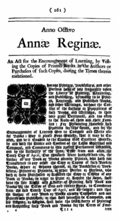

# Copyrights

## Introduction

### Section Overview

In this section, we will give an overview about what copyrights are, and how ownership of copyright can be described in software source code.

### Learning Objectives

By the end of this section, you should be able to:

* Explain what a copyright is.
* Look up more information about the purpose of copyright.
* Know ways to specify copyright notices in software source code.

## Copyrights

### What Is a Copyright?

Copyright holders are those able to define the license under which an original work can be used. The license is also known as the "terms of use".

[Wikipedia’s](https://en.wikipedia.org/wiki/Copyright) definition has had the most eyes on it, so we will use it to define a copyright:

> Copyright is a legal right created by the law of a country that grants the creator of an original work exclusive rights for its use and distribution."

It is important to note that countries have their own copyright laws. To a certain extent, international treaties like the [Berne Convention](https://en.wikipedia.org/wiki/Berne_Convention) and the [Universal Copyright Convention](https://en.wikipedia.org/wiki/Universal_Copyright_Convention) have standardized the treatment, but local variations in law do exist.

Original "work" can refer to creative, intellectual or artistic output. Software source code written by a person is considered an original work. Copyright does not cover the ideas or information, but rather how they are expressed (or written down). Ideas and algorithms can be covered by patent law instead. The work must be considered as original, rather than copied from somewhere else to be covered.


Retrieved from [Wikipedia](https://en.wikipedia.org/wiki/Copyright), used under [CC BY SA 3.0](https://creativecommons.org/licenses/by-sa/3.0/).

### A Bit of History...

Copyrights were originally created to preserve the rights of authors, when printing presses started to produce books in quantity.

Great Britain was the first country to recognize the rights of authors. The Copyright Act of 1709, or [Statute of Anne](https://en.wikipedia.org/wiki/Statute_of_Anne), was the first law that recognized the rights of authors, compared to the rights of those that produced and sold copies of the work.

This original law has been reworked and refined over time as technologies changed, to give us our present system.



**Statute of Anne**. Retrieved from [Wikipedia](https://en.wikipedia.org/wiki/Statute_of_Anne), used under [CC BY SA 3.0](https://creativecommons.org/licenses/by-sa/3.0/).

### The US Definition of Copyright

Over time, other countries have adopted the concept of copyright into their laws. One early adopter was the United States Constitution ([Article 1, Section 8](https://en.wikipedia.org/wiki/Copyright_Clause)): 

> To promote the Progress of Science and useful Arts, by securing for limited Times to Authors and Inventors the exclusive Right to their respective Writings and Discoveries.

The United States government has refined copyright laws in the United States under Title 17 of the United States Code to be a form of protection for original works of authorship, including literary, dramatic, musical, architectural, cartographic, pantomimic, pictorial, graphic, sculptural and audiovisual creations.

Software written by a person is considered to be an original work of authorship, and specifically a literary work, so it falls into this area of the law.

Taken literally, copyright means the right to copy. Today, it is a convenient way to refer to a body of exclusive rights granted to the copyright owner for protection of their work.

Copyright protection does have limits. In the United States, it does not extend to any idea, procedure, process, system, principle or discovery. Similarly, facts such as names, titles, short phrases, slogans, familiar symbols, typographic variations, lettering, coloring and listing of contents or ingredients are not subject to copyright.

### What About the International Definition of Copyright?

Over time, as each country evolved its own copyright law, at the international level it became harder and harder to figure out what rights applied to work created in one country but copied and reproduced in another.

In 1886, an international agreement was created in Berne, Switzerland, governing copyright. The [*Berne Convention for the Protection of Literary and Artistic Works*](https://en.wikipedia.org/wiki/Berne_Convention) requires those countries that have signed the convention to treat the copyright of works of authors from other signatory countries (known as members of the Berne Union) at least as well as those of its own nationals. This was also the first attempt to provide a minimum standard for copyright law. In particular, under the Berne Convention, copyright is automatic and need not be obtained through official registration with any government office. Up until this time, in some countries, registration with the government was required to be considered to hold copyright.

While registration is not needed to exercise copyright under the Berne Convention, in countries where the law provides for registrations, it does serve as evidence of a valid copyright and enables the copyright holder to seek statutory damages and reimbursement of attorney fees, when there is a dispute over the use of a copyrighted work.

The issue of registration, and the period of time that copyright is valid for, were some of the reasons why the United States did not sign the Berne Convention until 1989. It was only able to do this after it changed its own copyright laws in 1988, over 100 years after the Berne Convention was created.

### Who Is a Copyright Holder?

The author of the work is generally considered to be the copyright holder. In situations where there are multiple authors, each has a set of rights to use or license the work, and they are commonly referred to as [rights holders](https://en.wiktionary.org/wiki/rightsholder).

Often, when the work was created in the course of the author’s employment, it is considered as a “work for hire” and the employer is the copyright holder. For example, the “Copyright, Designs, and Patents Act of 1988” (which is a United Kingdom law), provides that if a copyrighted work is made by an employee in the course of that employment, the copyright is automatically owned by the employer. This can be different in some jurisdictions, particularly in Europe, as an example.

The rights of the copyright holder can also be assigned to another organization or individual. Some jurisdictions around the world may have different positions on who owns a copyright, so you should always check with local counsel first.

### Copyright Notices

Under the Berne Convention, an author doesn’t need to register their copyright in order to own it. The copyright exists upon the creation of the work. However, it is often still considered a good idea to insert a copyright notice in the body of the work, to make it clear that the work is copyrighted and provide guidance about who the copyright holders are. Additionally, some open source licenses are written with the expectation that a copyright notice will be present and should be reproduced in distributions of the software.

Copyright notices in open source software projects tend to follow one of two different categories of formats.

#### Historical Format

Traditionally, copyright notices in open source software projects have tended to follow a model similar to the following:

```plaintext
Copyright (C) 2001, 2004-2006 Company ABC.
```

This format typically includes one or more of the following, in varying combinations:

* the word "Copyright"
* the symbol "(C)" or ©
* a year or series / range of years
* the name of the individual or legal entity who is the copyright holder.

This format is generally similar to the form described in the US copyright laws in [17 U.S.C. § 401](https://www.law.cornell.edu/uscode/text/17/401). That section describes a format which, when used, may help in a US copyright infringement lawsuit if a defendant claims innocent infringement.

The years in this format of notice are typically the year of first publication, along with years in which additional copyrightable content was contributed to the project or file.

This format is commonly seen in source code, including open source software. However, this format is not required in order for a person or legal entity to own a copyright. As mentioned earlier, the copyright will exist when the work is fixed in a tangible medium of expression, regardless of whether or how a notice is included.

Additionally, when this form is used in other media besides software (such as a book or movie), it is more common that it is a single fixed work, published at a point in time with an easily-enumerable set of copyright holders. This may be less likely to be true for source code in open source software projects, which changes over time as existing and new contributors make changes to a project and its files. Because of this, the next format described below is becoming more common in some open source communities.

Sometimes later contributors to the file do not update the year or list of owners in the notice when adding new copyrightable content. As a result, the specified notice might not be accurate for the file as a whole.

#### Newer Format

Copyright notices can take other forms besides the historical format. In newer open source projects which have (or expect to have) many different contributors, and where the contributors retain ownership of their contributions, some projects express copyright notices using a form similar to the following:

```plaintext
Copyright Contributors to the ___________ Project.
```

or

```plaintext
Copyright The ___________ Contributors.
```

This format is intended to be a simple statement that the work is copyrighted; that the contributors of the code licensed it, but retain ownership of their copyrights; and that it was licensed for distribution as part of the specified project.

This aims to make compliance easier by minimizing variations of notices that downstream recipients have to reproduce, in order to comply with the open source license. It also aims to ease the burden on developers who contribute to open source projects, by removing the need to remember to update copyright notices with every commit; or to make determinations about whether a particular commit should result in updating a date or adding a new notice.

It also helps to remove the implication that the listed copyright holders comprise the entirety of all copyright owners in a particular project or file. When a single individual or legal entity is named in a copyright notice under the historical style, it is often the original contributor of that particular file. But as new people make contributions to the same project or file, they may not add their own copyright notice at the top of the file — even when they do in fact own the copyright to their contributions. As a result, using a notice in this newer format may in fact be more accurate than a list of specific contributors.

---

If you are contributing to an open source project on behalf of your employer, you will likely want to speak with your company’s legal counsel to discuss whether there is a particular format of copyright notice that they require you to use.

### Examples of Copyright Notices

Here are some examples of copyright notices, in both the historical and newer formats described on the prior page.

#### Historical Format

```plaintext
Copyright 1998, Linus Torvalds
```

```plaintext
© 2003, 2010, Free Software Foundation, Inc.
```

```plaintext
Copyright (C) 2011, 2014-2019 Company ABC.
```

#### Newer Format

```plaintext
Copyright The Kubernetes Authors.
```

```plaintext
Copyright Contributors to the OpenVDB Project.
```

```plaintext
Copyright the Hyperledger Fabric contributors.
```

#### To Add or Not to Add Copyright Notices?

It is frequently discussed by developers whether a copyright notice should be added or not. Our recommendation is that for a new file, the author should always add a copyright notice. This notice could be in the general, newer format as described above, or could include more of the traditional format details such as the date, copyright holder’s name, etc. When an author makes significant changes in an existing file, the copyright notice should be updated as well if the traditional format is being used.

Before 1989, the use of copyright notices was mandatory in the United States, as was registering copyrights. By adopting the terms of the Berne Convention, the United States had to modify its own laws to be able to conform. Since the Berne Convention makes copyright automatic, the use of copyright notices to claim copyright has become optional.

It is important to note that a third party’s copyright notice should never be modified or removed by anyone other than that third party, or at their direction. Regardless of the format that contributors to a project might use for their own notices, when reproducing content from a third party, their copyright notice should be provided in the format they have used and should only be modified or removed by them.

Finally, if you are writing code that you are contributing to an open source software project, avoid including the phrase "All Rights Reserved". Many proprietary software files may contain this notice, and so programmers sometimes include it after copyright notices in open source software projects. There is no reason to think that its presence changes or undermines the rights that are granted by the open source license for that project. However, including that phrase is at best confusing, so it is better to omit it.

### REUSE Software Guidelines for Copyright Notices

In the earlier section on Licenses, we discussed the [REUSE Software Guidelines](https://reuse.software/spec/) and their recommendations for how to express license notices using SPDX short-form identifiers.

REUSE also provides recommendations for how to express copyright notices in a file. Their recommendations generally follow the historical model, in that they require the inclusion of the names of the copyright holders, and encourage the inclusion of year of publication.

In particular, REUSE also encourages the use of [SPDX file tags](https://github.com/spdx/spdx-spec/blob/development/v2.2/chapters/appendix-IX-file-tags.md) for copyright notices. SPDX file tags were added in version 2.2 of the SPDX specification, and they provide a format for per-file information in a single, easily searchable line, similar to SPDX short-form license identifiers. REUSE recommends using these to express copyright notices in files with the **SPDX-FileCopyrightText:** tag, as in the following examples:

```plaintext
SPDX-FileCopyrightText: 2019 Jane Doe
```

or

```plaintext
SPDX-FileCopyrightText: © 2019 John Doe 
```

## Summary

### Conclusion

You should now be able to understand what copyright means and why copyright notices appear in source code.

You should be able to recognize the more "traditional" style of copyright notices as well as newer styles that may omit years or names of copyright holders, and you should be able to discuss with your own legal counsel if there is a preferred format for your employer’s contributions to open source projects.
